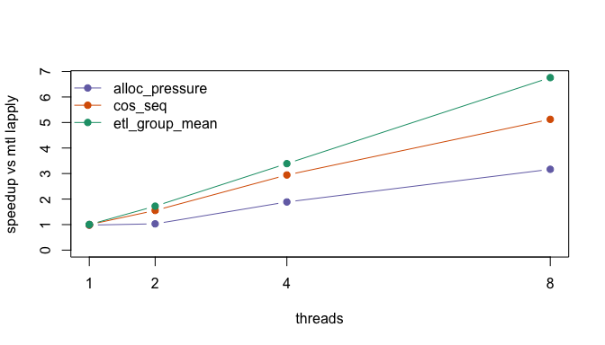
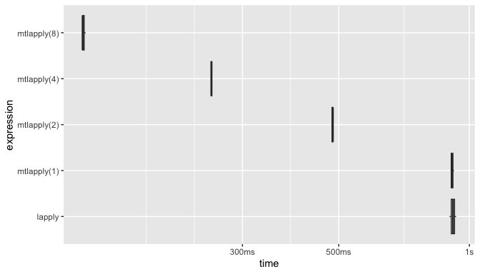

# R Multi-Threaded Interpreter Experiment (`mtlapply`)

This repo is an experimental R runtime that can evaluate *pure R*
closures concurrently on multiple OS threads, in a single R process,
using `mtlapply()` (modeled after `lapply()`/`mclapply()`).

The hook is simple: when your workload is “a lot of independent R work”
(feature engineering, per-shard transforms, per-group summaries),
`mtlapply()` can give near-linear speedups without forking and without
serializing return values.

## A Benchmark You Can Read (And Reproduce)

The “unit of parallelism” here is a shard id. There is no up-front
“pre-splitting”; the `mtlapply()` call is what shards the work.

``` r
# This is the actual benchmark code (identical in shape to bench/readme_bench_run.R).
# The key idea: mtlapply() shards work by shard id; the worker computes its own
# row indices deterministically. No up-front "split" required.

N <- 2e6L
nshards <- 64L
ngroups <- 4096L
feat_loops <- 40L

# Deterministic data (no RNG, no strings).
x <- (as.double(seq_len(N) %% 1000L) - 500) / 10
y <- (as.double((seq_len(N) * 17L) %% 1000L) - 500) / 10
w <- (as.double((seq_len(N) * 31L) %% 1000L) + 1) / 1000
grp <- rep_len(seq_len(ngroups), N)

worker <- function(shard_id) {
  idx <- seq.int(shard_id, N, by = nshards)
  z <- x[idx]
  for (i in seq_len(feat_loops)) {
    z <- log1p(abs(z)) + sin(y[idx] + z) * w[idx] + cos(z - y[idx])
  }
  g <- grp[idx]  # groups for summarise
  # summarise: group-wise sum, plus counts
  n <- tabulate(g, ngroups)
  s <- numeric(ngroups)
  for (j in seq_along(z)) {
    gj <- g[[j]]
    s[[gj]] <- s[[gj]] + z[[j]]
  }
  list(sum = s, n = n)
}

reduce <- function(parts) {
  s <- Reduce(`+`, lapply(parts, `[[`, "sum"))
  n <- Reduce(`+`, lapply(parts, `[[`, "n"))
  s / n
}

ids <- seq_len(nshards)

# baseline
system.time(reduce(lapply(ids, worker)))[["elapsed"]]

# parallel (in the experimental build)
system.time(reduce(mtlapply(ids, worker, threads = 8L)))[["elapsed"]]
```

## Real Numbers (Loaded From Artifacts)

The benchmark is run as a standalone base-R script under:

- the system `R` (to check for single-threaded regressions)
- `./build-mtl/bin/R` from this tree (to measure `mtlapply()` scaling)

Generate the timing artifacts:

``` sh
mkdir -p bench/results

# system R (no mtlapply)
R --vanilla -q -f bench/readme_bench_run.R --args bench/results/system.rds

# R-devel (no mtlapply)
/usr/local/bin/R-devel --vanilla -q -f bench/readme_bench_run.R --args bench/results/rdevel.rds

# experimental build (has mtlapply)
./build-mtl/bin/R --vanilla -q -f bench/readme_bench_run.R --args bench/results/mtl.rds

# optional: generate a bench::mark artifact under the experimental build
R_LIBS_USER=/private/tmp/mtl-proof-lib-MW1vv9 R_LIBS_SITE='' \
  ./build-mtl/bin/R --vanilla -q -f bench/readme_bench_mark.R --args bench/results/mtl_bench_mark.rds
```

Then render this README, which loads those artifacts and summarizes
them:

    ## Settings:

| setting    | value   |
|:-----------|:--------|
| N          | 5000000 |
| nshards    | 64      |
| ngroups    | 4096    |
| feat_loops | 80      |
| cos_m      | 600000  |
| cos_k      | 512     |
| alloc_m    | 150000  |
| alloc_k    | 256     |
| iters      | 9       |
| threads    | 1,2,4,8 |

    ## 
    ## R versions:

| build  | r_version                                          |
|:-------|:---------------------------------------------------|
| system | R version 4.5.2 (2025-10-31)                       |
| rdevel | R Under development (unstable) (2026-02-09 r89390) |
| mtl    | R Under development (unstable) (2026-02-10 r99999) |

    ## 
    ## Timings:

| workload | build | label | median_seconds | speedup_vs_rdevel_lapply | speedup_vs_sys_lapply | speedup_vs_mtl_lapply | efficiency_vs_mtl_lapply |
|:---|:---|:---|---:|---:|---:|---:|---:|
| alloc_pressure | mtl | lapply | 0.513 | 0.990 | 0.926 | 1.000 | NA |
| alloc_pressure | mtl | mtlapply(1) | 0.523 | 0.971 | 0.908 | 0.981 | 0.981 |
| alloc_pressure | mtl | mtlapply(2) | 0.498 | 1.020 | 0.954 | 1.030 | 0.515 |
| alloc_pressure | mtl | mtlapply(4) | 0.272 | 1.868 | 1.746 | 1.886 | 0.472 |
| alloc_pressure | mtl | mtlapply(8) | 0.162 | 3.136 | 2.932 | 3.167 | 0.396 |
| alloc_pressure | rdevel | lapply | 0.508 | 1.000 | 0.935 | 1.010 | NA |
| alloc_pressure | system | lapply | 0.475 | 1.069 | 1.000 | 1.080 | NA |
| cos_seq | mtl | lapply | 2.331 | 1.079 | 0.994 | 1.000 | NA |
| cos_seq | mtl | mtlapply(1) | 2.372 | 1.060 | 0.977 | 0.983 | 0.983 |
| cos_seq | mtl | mtlapply(2) | 1.500 | 1.676 | 1.545 | 1.554 | 0.777 |
| cos_seq | mtl | mtlapply(4) | 0.792 | 3.174 | 2.927 | 2.943 | 0.736 |
| cos_seq | mtl | mtlapply(8) | 0.455 | 5.525 | 5.095 | 5.123 | 0.640 |
| cos_seq | rdevel | lapply | 2.514 | 1.000 | 0.922 | 0.927 | NA |
| cos_seq | system | lapply | 2.318 | 1.085 | 1.000 | 1.006 | NA |
| etl_group_mean | mtl | lapply | 4.433 | 1.134 | 0.941 | 1.000 | NA |
| etl_group_mean | mtl | mtlapply(1) | 4.417 | 1.138 | 0.944 | 1.004 | 1.004 |
| etl_group_mean | mtl | mtlapply(2) | 2.574 | 1.952 | 1.620 | 1.722 | 0.861 |
| etl_group_mean | mtl | mtlapply(4) | 1.308 | 3.842 | 3.189 | 3.389 | 0.847 |
| etl_group_mean | mtl | mtlapply(8) | 0.656 | 7.660 | 6.358 | 6.758 | 0.845 |
| etl_group_mean | rdevel | lapply | 5.025 | 1.000 | 0.830 | 0.882 | NA |
| etl_group_mean | system | lapply | 4.171 | 1.205 | 1.000 | 1.063 | NA |

    ## 
    ## Single-thread overhead check (per workload):

| workload       | ratio_mtl_vs_sys | ratio_mtl_vs_rdevel |
|:---------------|-----------------:|--------------------:|
| alloc_pressure |            1.080 |               1.010 |
| cos_seq        |            1.006 |               0.927 |
| etl_group_mean |            1.063 |               0.882 |

    ## 
    ## Scaling (speedup vs `mtl` lapply):

<!-- -->

    ## 
    ## bench::mark (mtl build, same workload; plotted):

    ## # A data frame: 5 × 13
    ##   expression    min median `itr/sec` mem_alloc `gc/sec` n_itr  n_gc total_time
    ##   <bch:expr>  <dbl>  <dbl>     <dbl> <bch:byt>    <dbl> <int> <dbl>      <dbl>
    ## 1 lapply      0.900  0.917      1.09        NA     61.8     3   170      2.75 
    ## 2 mtlapply(1) 0.905  0.911      1.10        NA     42.4     3   116      2.74 
    ## 3 mtlapply(2) 0.481  0.484      2.07        NA     37.9     3    55      1.45 
    ## 4 mtlapply(4) 0.254  0.254      3.93        NA     43.2     3    33      0.764
    ## 5 mtlapply(8) 0.128  0.129      7.74        NA     36.1     3    14      0.387
    ## # ℹ 4 more variables: result <list>, memory <list>, time <list>, gc <list>

<!-- -->

## Notes / Limitations

- Workloads that hammer global mutable runtime structures (notably
  string/symbol interning) may scale poorly.
- Some operations are still serialized under a global lock when run from
  workers (notably selected native interfaces), to avoid corrupting
  global process state.
- This is runtime work: correctness and safety come before “make
  everything parallel”.
